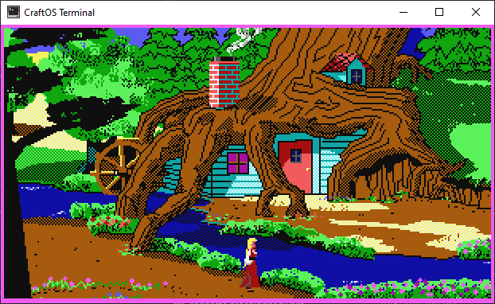

# CraftOS-PC
CraftOS-PC is a port of the CraftOS operating system from the popular Minecraft mod [ComputerCraft](https://github.com/dan200/ComputerCraft). This is a mostly full port of the mod to desktop, removing the parts that only work in a Minecraft world.  

## What works
* Full terminal interaction (mouse/keyboard)
* Color support
* Most programs written for ComputerCraft should work out-of-the-box
* HTTP requests
* Peripherals (printers, speakers, monitors)
* Platform-independent (works on all systems with Java 8)

## New features in CraftOS-PC
* Shared mounts from real PC
* Pixel-based graphics mode
* Resizeable terminals
* HTTP server functionality

## What doesn't work
* Networking/multi-computer support

## Usage
Just download and run the JAR or EXE file available in the releases and the terminal will automatically start.

## Files
ComputerCraft's root directory is located at `<your home directory>/.craftos/computer/0`. You can place files here, and they will appear in the root directory of the computer.  
You can also mount real directories with the `mount` command: `mount /CDrive C:\ `, `mount /Documents /home/user/Documents`.

## License
Since this is based on ComputerCraft it follows the same license as it does. You can read it [here](https://github.com/dan200/ComputerCraft/blob/master/LICENSE) as well as in LICENSE in this repository.
