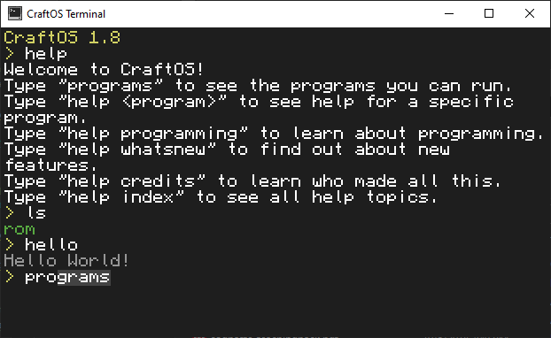
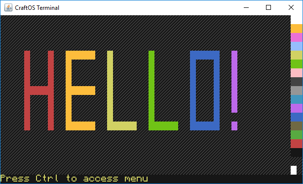

# CraftOS-PC
CraftOS-PC is a port of the CraftOS operating system from the popular Minecraft mod [ComputerCraft](https://github.com/dan200/ComputerCraft). This is a mostly full port of the mod to desktop, removing the parts that only work in a Minecraft world.  

## What works
* Full terminal interaction (mouse/keyboard)
* Color support
* Most programs written for ComputerCraft should work out-of-the-box
* HTTP
* Peripherals (printers, speakers, monitors)
* Mountable drives

## What doesn't work
* Networking/multi-computer support

## How to use
Just download and run the JAR file available in the releases and the terminal will automatically start.

## How to add files
Since ComputerCraft runs sandboxed you cannot access your files normally. The root folder is located at ~/.craftos/computer/0/ or %USERHOME%\.craftos\computer\0\. Any files copied into that folder will be accessible at / inside CraftOS.

## License
Since this is based on ComputerCraft it follows the same license as it does. You can read it [here](https://github.com/dan200/ComputerCraft/blob/master/LICENSE) as well as in LICENSE in this repository.
